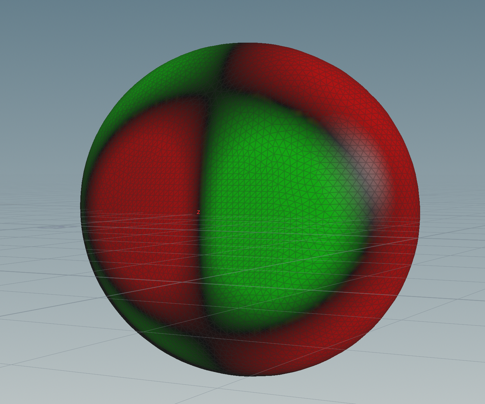
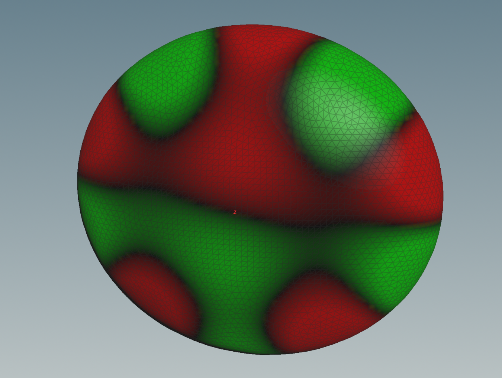
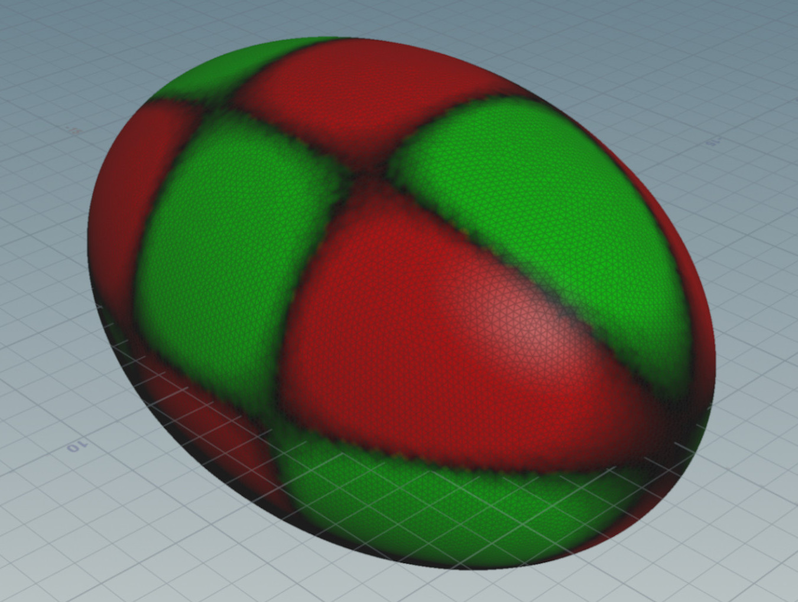

# Sound of Surfaces

This app is a software synthesizer that makes virtual surfaces sound.

## Run the App

* Clone the following [GitHub repository](https://github.com/ChristophSeidel1234/Surface_Sound)
* Open a terminal an go to your current working directory.
* Now we recommend to build a virtual environment so that all used modules run conflict-free. Here is a way to do that with `venv`. This is a Python buildt in environment that does not require any additional installation and has the advantage that it only exists locally in this folder. For more information see  [venv](https://docs.python.org/3/library/venv.html#module-venv)
    * Create a new environment\
    `python -m venv .venv`
    The last parameter, `.venv`, is the name of the directory to install the virtual environment into. You can name this whatever you would like.
    * Activate the environment\
    If you are on Windows, you will use `.venv\Scripts\activate.bat`.\
    On other OSes, you will use source `.venv/bin/activate.`
    * Install all required modules\
    `pip install -r requirements.txt`
    * Once you are finished, just use the `deactivate` command to exit the virtual environment.

* run the app\
`streamlit run app.py`

## Instructions
We go step by step from top to bottom through the app.
* **Select Surface**\
I have chosen the shape of the surfaces (i.e. tuned them) so that the fundamental tone together with the first overtones form a major, minor or power cord.

  
  
  

* **Number of Overtones**\
Here one can set the number of generalized harmonics. If you select more, the sound becomes more glassy.
* **Select Waveform**\
These are the different initial conditions. For example, `cone` means that one pulls out something like a tent at the surface, comparable with picking a guitar string.
* **Pick or Strike**\
Pick gives the location and strike the speed in the initial conditions. If you think of physical instruments, this would be the difference between a piano and a harpsichord.
* **Propagation Velocity**\
This means how fast is the speed of the wave on the surface. This is also like tuning an instrument, since the propagation velocity is coupled to the frequencies in the wave equation.

Finally, I would like to mention that each change of the above options writes or changes a file named `new_signal.wav` on your desktop with respect to the selected properties.

