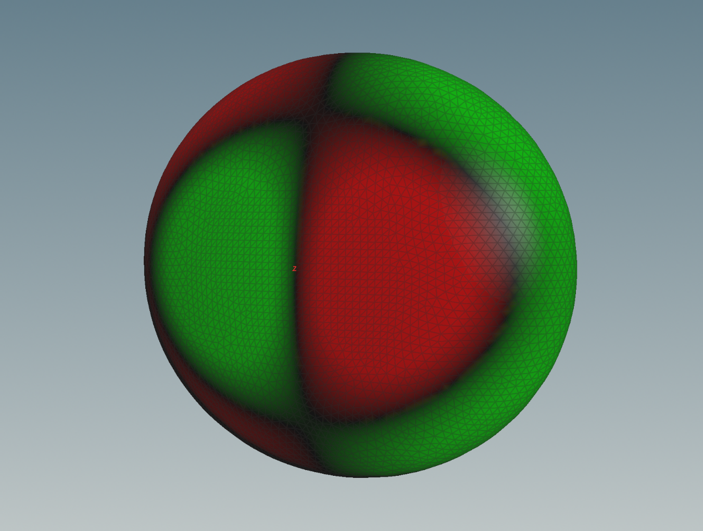

# Sound of Surfaces

This app is a software synthesizer that makes virtual surfaces sound. To put it more precisely, we solve the wave equation on surfaces and additionally glue every conceivable recorded sound onto it. The basic idea is that we know the [Chladni figures](https://en.wikipedia.org/wiki/Ernst_Chladni#Chladni_figures) and make sound out of it.

## Run the App

* Clone the following [GitHub repository](https://github.com/ChristophSeidel1234/Surface_Sound)
* Open a terminal and go to your current working directory.
* Now we recommend to build a virtual environment so that all used modules run conflict-free. Here is a way to do that with `venv`. This is a Python build in environment that does not require any additional installation and has the advantage that it only exists locally in this folder. For more information see  [venv](https://docs.python.org/3/library/venv.html#module-venv)
    * Create a new environment\
    `python -m venv .venv`
    The last parameter, `.venv`, is the name of the directory to install the virtual environment into. You can name this whatever you would like.
    * Activate the environment\
    If you are on Windows, you will use `.venv\Scripts\activate.bat`\
    On other OSes, you will use `source .venv/bin/activate`
    * Install all required modules\
    `pip install -r requirements.txt`
    * Once you are finished, just use the `deactivate` command to exit the virtual environment.

* Run the app\
`streamlit run app.py`\
At this point you will be asked for your e-mail address in order to register with streamlit.

## Instructions
We go step by step from top to bottom through the app.
* **Select Surface**\
We have chosen the shape of the surfaces (i.e. tuned them) so that the fundamental tone together with the first overtones form a major, minor or power cord.

  
  
  

* **Number of Overtones**\
Here one can set the number of generalized harmonics. If you select more, the sound becomes more glassy.
* **Select Initial Shape**\
These are the different shapes of the initial conditions. `Cone` means that one pulls out something like a tent at the surface, comparable with picking a guitar string, whereas `Cylinder` just means a cylindrical shape of the initial conditions.

  
  

* **Initial Value Domain**\
This slider indicates on which part of the surface the initial shape is defined. If it is close to zero, only one point is extracted, whereas if it is one, the initial shape is created on the entire surface.

  
  

* **Pick or Hit**\
Pick gives the location and Hit the speed in the initial conditions. If you think of physical instruments, this would be the difference between a piano and a harpsichord.
* **Propagation Velocity**\
This means how fast is the speed of the wave on the surface. This is also like tuning an instrument, since the propagation velocity is coupled to the frequencies in the wave equation.
* **Morphing Width**\
   Here you can specify how much the recorded sound should be morphed onto the surface. The construction is as follows: build a rectangular function of width 2 * `Morphing Width` around the discrete spectrum of the surface, smooth this with a suitable [mollifier](https://en.wikipedia.org/wiki/Mollifier) via the [convolution theorem](https://en.wikipedia.org/wiki/Convolution_theorem), multiply this with the spectrum of the recorded sound and send it back with the inverse [Fourier transfom](https://en.wikipedia.org/wiki/Fourier_transform).\
   \
   This can also be seen as a very special filter that opens many small gates that nestle around the surface spectrum.
* **Select Noise**\
These are the different types of noise that are glued onto the function that is placed around the surface spectrum. You can listen to that when you play
`The Sound of the Surface surrounded by the Morphing Function which is equipped with a Noise`. If you select `No Noise` it becomes clear why it makes sense to multiply an additional noise on the spectrum.

* **The pure Surface Sound**\
It is simply the pure sound of the virtual surface.
* **The Sound of the Surface surrounded by the Morphing Function which is equipped with a Noise**\
Here we nestle a smoothed function around the spectrum, which is equipped with a noise that can be selected in the `Select Noise` box.
* **Choose a File**\
Please use only wav files. You can find some examples in the folder recorded_sounds.
* **Uploaded Sound**\
The uploaded sound
* **Graphics**
   * **Surface Spectrum and Morphing Function**\
     Shows the spectra of the surface and the morphing function you have choosen.
   * **Surface Spectrum and Recorded Spectrum**\
     This is the graphic you should work with. Here you can synchronise the fundamental tone of both spectra via the `Propagation Velocity / Tuning` slider.
  
Finally, we would like to mention that each change of the above options writes or changes files named `new_signal.wav`, `envelope_signal.wav` and `morphed_signal.wav` on your desktop with respect to the selected properties.

